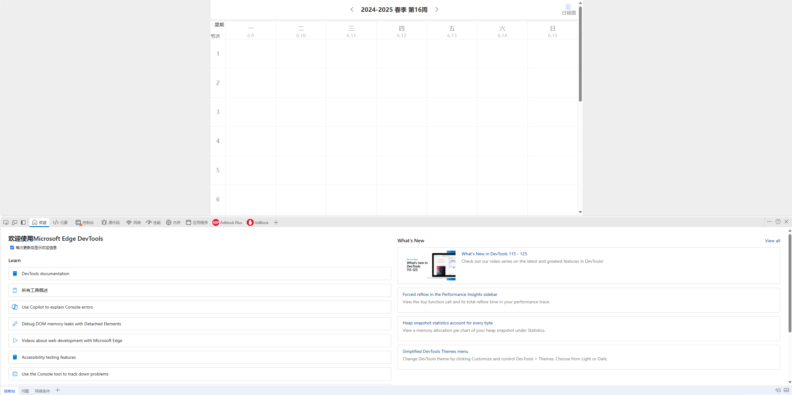
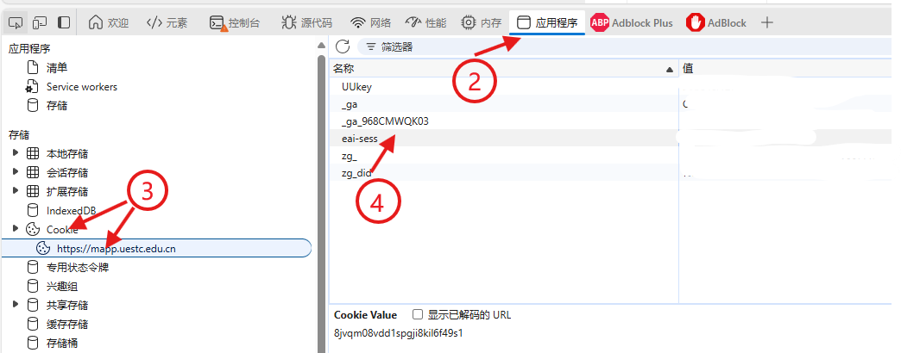

# UESTC_schedule：一个简单的导出UESTC本科生课表的小程序

<!-- **[English version](README.md)** -->

**支持导出日历ics文件和json文件**
**登录网上服务大厅功能使用了项目[UESTC_login](https://github.com/xyangzhou/UESTC_login)**
## 例子
支持账号密码登录与cookies登录。本程序不具备也不会保存、泄露您的账户密码与cookies的功能，所有账户相关敏感内容仅用于获取mapp.uestc.edu.cn以及idas.uestc.edu.cn之内容。

关于cookies获取，见[Cookies 的获取](#cookies-的获取)
```bash
# 获取2024-2025学年第二学期的所有周课表
./generator -y 2024-2025 -t 2 --enable_pwd --username <STUDENT_ID> --password <PASSWORD>
# 获取2024-2025学年第二学期的1-13周课表
./generator -y 2024-2025 -t 2 -w 1-13 --enable_pwd --username <STUDENT_ID> --password <PASSWORD>
# 使用cookie方法获取2024-2025学年第二学期的第5周课表，导出为schedule目录下的schedule.json和schedule.ics
./generator -y 2024-2025 -t 2 -w 5 -c 8jvqq08vdd1ssghi8kil6f4961 -o schedule/schedule
# 注意给出的8jvqq08vdd1ssghi8kil6f4961为示范
```


## 用法
在 release 中，给出了一个由 [PyInstaller](https://pyinstaller.org/en/stable/) 打包的可执行文件，可以直接下载对应版本使用。

- Windows
```powershell
# e.g. ./generator.exe -y 2024-2025 -t 2 --enable_pwd --username 学号 --password 密码
./generator.exe -y <YEAR: XXXX-XXXX> -t <TERM: 1 OR 2> --enable_pwd --username <STUDENT_ID> --password <PASSWORD>
# e.g. ./generator.exe -y 2024-2025 -t 2 -c <COOKIES>
./generator.exe -y <YEAR: XXXX-XXXX> -t <TERM: 1 OR 2> -c <COOKIES>
```

- Linux
```Bash
# e.g. ./generator -y 2024-2025 -t 2 --enable_pwd --username 学号 --password 密码
./generator -y <YEAR: XXXX-XXXX> -t <TERM: 1 OR 2> --enable_pwd --username <STUDENT_ID> --password <PASSWORD>
# e.g. ./generator -y 2024-2025 -t 2 -c <COOKIES>
./generator -y <YEAR: XXXX-XXXX> -t <TERM: 1 OR 2> -c <COOKIES>
```

参数：
```
usage: main [-h] -y YEAR -t {1,2} [-w WEEK] [-c COOKIES] [-f CONFIG_PATH] [-o OUTPUT_NAME] [--afk AFK] [--username USERNAME] [--password PASSWORD] [--enable_pwd]

Generate a schedule for a given term and weeks

optional arguments:
  -h, --help            show this help message and exit
  -y YEAR, --year YEAR  The year of the term, format of XXXX-XXXX, e.g., 2024-2025
  -t {1,2}, --term {1,2}
                        The term number, choose from 1, 2
  -w WEEK, --week WEEK  The week number, format of Int or Int-Int, e.g., 1 and 1-3. If do not specified or specified as -1, get all of the weeks.
  -c COOKIES, --cookies COOKIES
                        The cookies for the schedule website, the value of eai-sess in https://mapp.uestc.edu.cn/site/weekschedule/index
  -f CONFIG_PATH, --config_path CONFIG_PATH
                        The path to the config file
  -o OUTPUT_NAME, --output_name OUTPUT_NAME
                        The output file path, default is schedule which means ./schedule.json and ./schedule.ics
  --afk AFK             The time to wait between requests by weeks, default is 0.1s
  --username USERNAME   The username for https://eportal.uestc.edu.cn/
  --password PASSWORD   The password for https://eportal.uestc.edu.cn/
  --enable_pwd          Enable password login, if not set, use cookies login. If set, username and password are required.
```

## 从源码运行
### 0. 克隆此仓库
```Bash
git clone --recursive https://github.com/xyangzhou/UESTC_schedule.git
cd UESTC_schedule
```

### 1. 安装依赖项
此代码在 Python 3.9 下进行测试。使用 [Requests](https://github.com/psf/requests)、[BeautifulSoup4](https://www.crummy.com/software/BeautifulSoup/) 和 [Js2Py](https://github.com/PiotrDabkowski/Js2Py) 库。
```Bash
######## 可选 #######
conda create --name UESTC_login python=3.9
conda actiavte UESTC_login
######## 可选 #######
pip install -r requirements.txt
```

### 2. 运行
```Bash
python main.py -y <YEAR: XXXX-XXXX> -t <TERM: 1 OR 2> --enable_pwd --username <STUDENT_ID> 
```

参数：
```
usage: main [-h] -y YEAR -t {1,2} [-w WEEK] [-c COOKIES] [-f CONFIG_PATH] [-o OUTPUT_NAME] [--afk AFK] [--username USERNAME] [--password PASSWORD] [--enable_pwd]

Generate a schedule for a given term and weeks

optional arguments:
  -h, --help            show this help message and exit
  -y YEAR, --year YEAR  The year of the term, format of XXXX-XXXX, e.g., 2024-2025
  -t {1,2}, --term {1,2}
                        The term number, choose from 1, 2
  -w WEEK, --week WEEK  The week number, format of Int or Int-Int, e.g., 1 and 1-3. If do not specified or specified as -1, get all of the weeks.
  -c COOKIES, --cookies COOKIES
                        The cookies for the schedule website, the value of eai-sess in https://mapp.uestc.edu.cn/site/weekschedule/index
  -f CONFIG_PATH, --config_path CONFIG_PATH
                        The path to the config file
  -o OUTPUT_NAME, --output_name OUTPUT_NAME
                        The output file path, default is schedule which means ./schedule.json and ./schedule.ics
  --afk AFK             The time to wait between requests by weeks, default is 0.1s
  --username USERNAME   The username for https://eportal.uestc.edu.cn/
  --password PASSWORD   The password for https://eportal.uestc.edu.cn/
  --enable_pwd          Enable password login, if not set, use cookies login. If set, username and password are required.
```

## TODO
- [ ] 非常奇怪的是大部分国产手机的系统日历并不支持ics。
- [ ] 教务系统使用了瑞数vmp反爬虫，若能够成功应对，则本脚本将替换为直接从教务系统中获取。
- [ ] PyInstaller 打包后文件很大，后期考虑使用CPP替代。
- [ ] 由于验证码从未触发过，因此尚不支持验证码。

## Cookies 的获取
1. 使用浏览器登录[https://mapp.uestc.edu.cn/site/weekschedule/index][https://mapp.uestc.edu.cn/site/weekschedule/index]
2. 按F12打开浏览器开发工具

3. 在`应用程序/Application`中找到`Cookie`
4. 在`Cookie`中找到`https://mapp.uestc.edu.cn/`并点击
5. 在打开的页面中找到`名称/name`为`eai-sess`的项，复制其`值/value`


6. 使用参数 -c传入即可